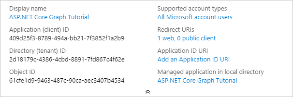

<!-- markdownlint-disable MD002 MD041 -->

En este ejercicio, creará un nuevo registro de aplicaciones Web de Azure AD con el centro de administración de Azure Active Directory.In this exercise, you will create a new Azure AD web application registration using the Azure Active Directory admin center.

1. Abra un explorador y vaya al [centro de administración de Azure Active Directory](https://aad.portal.azure.com).Open a browser and navigate to the [Azure Active Directory admin center](https://aad.portal.azure.com). Inicie sesión con una **cuenta personal** (también conocida como: cuenta Microsoft) o una **cuenta profesional o educativa**.Login using a **personal account** (aka: Microsoft Account) or **Work or School Account**.

1. Seleccione **Azure Active Directory** en el panel de navegación izquierdo y, a continuación, seleccione **Registros de aplicaciones** en **Administrar**.Select **Azure Active Directory** in the left-hand navigation, then select **App registrations** under **Manage**.

    

1. Seleccione **Nuevo registro**.Select **New registration**. En la página **Registrar una aplicación** , establezca los valores siguientes.On the **Register an application** page, set the values as follows.

    - Establezca **Nombre** como `ASP.NET Core Graph Tutorial`.Set **Name** to `ASP.NET Core Graph Tutorial`.
    - Establezca **Tipos de cuenta admitidos** en **Cuentas en cualquier directorio de organización y cuentas personales de Microsoft**.Set **Supported account types** to **Accounts in any organizational directory and personal Microsoft accounts**.
    - En **URI de redirección** , establezca la primera lista desplegable en `Web` y establezca el valor `https://localhost:5001/`.Under **Redirect URI** , set the first drop-down to `Web` and set the value to `https://localhost:5001/`.

    

1. Seleccione **Registrar**.Select **Register**. En la página del **tutorial de ASP.net Core Graph** , copie el valor del identificador de la **aplicación (cliente)** y guárdelo, lo necesitará en el paso siguiente.On the **ASP.NET Core Graph Tutorial** page, copy the value of the **Application (client) ID** and save it, you will need it in the next step.

    

1. Seleccione **Autenticación** en **Administrar**.Select **Authentication** under **Manage**. En **URI de redireccionamiento** , agregue un URI con el valor `https://localhost:5001/signin-oidc` .Under **Redirect URIs** add a URI with the value `https://localhost:5001/signin-oidc`.

1. Establezca la **dirección URL de cierre de sesión** en `https://localhost:5001/signout-oidc` .Set the **Logout URL** to `https://localhost:5001/signout-oidc`.

1. Busque la sección **Concesión implícita** y habilite los **tokens de ID**.Locate the **Implicit grant** section and enable **ID tokens**. Seleccione **Guardar**.Select **Save**.

    

1. Seleccione **Certificados y secretos** en **Administrar**.Select **Certificates & secrets** under **Manage**. Seleccione el botón **Nuevo secreto de cliente**.Select the **New client secret** button. Escriba un valor en **Descripción** y seleccione una de las opciones para **Expires** y seleccione **Agregar**.Enter a value in **Description** and select one of the options for **Expires** and select **Add**.

    

1. Copie el valor del secreto de cliente antes de salir de esta página.Copy the client secret value before you leave this page. Lo necesitará en el siguiente paso.You will need it in the next step.

    > [!IMPORTANT]
    > El secreto de cliente no se vuelve a mostrar, así que asegúrese de copiarlo en este momento.This client secret is never shown again, so make sure you copy it now.

    
