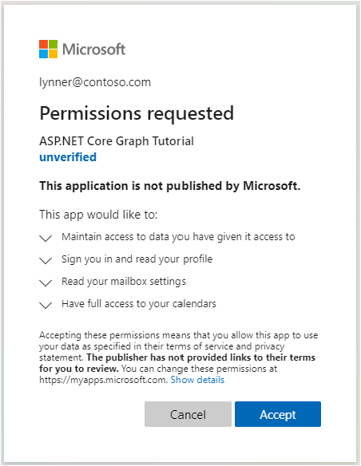

<!-- markdownlint-disable MD002 MD041 -->

<span data-ttu-id="98393-101">En este ejercicio, ampliará la aplicación del ejercicio anterior para admitir la autenticación con Azure AD.</span><span class="sxs-lookup"><span data-stu-id="98393-101">In this exercise you will extend the application from the previous exercise to support authentication with Azure AD.</span></span> <span data-ttu-id="98393-102">Esto es necesario para obtener el token de acceso de OAuth necesario para llamar a la API de Microsoft Graph.</span><span class="sxs-lookup"><span data-stu-id="98393-102">This is required to obtain the necessary OAuth access token to call the Microsoft Graph API.</span></span> <span data-ttu-id="98393-103">En este paso, configurará la biblioteca [Microsoft. Identity. Web](https://www.nuget.org/packages/Microsoft.Identity.Web/) .</span><span class="sxs-lookup"><span data-stu-id="98393-103">In this step you will configure the [Microsoft.Identity.Web](https://www.nuget.org/packages/Microsoft.Identity.Web/) library.</span></span>

> [!IMPORTANT]
> <span data-ttu-id="98393-104">Para evitar almacenar el identificador de aplicación y el secreto en el origen, deberá usar el [Administrador de secretos de .net](/aspnet/core/security/app-secrets) para almacenar estos valores.</span><span class="sxs-lookup"><span data-stu-id="98393-104">To avoid storing the application ID and secret in source, you will use the [.NET Secret Manager](/aspnet/core/security/app-secrets) to store these values.</span></span> <span data-ttu-id="98393-105">El administrador de secretos solo se usa con fines de desarrollo, las aplicaciones de producción deben usar un administrador de secretos de confianza para almacenar secretos.</span><span class="sxs-lookup"><span data-stu-id="98393-105">The Secret Manager is for development purposes only, production apps should use a trusted secret manager for storing secrets.</span></span>

1. <span data-ttu-id="98393-106">Abra **./appsettings.jsen** y reemplace su contenido por lo siguiente.</span><span class="sxs-lookup"><span data-stu-id="98393-106">Open **./appsettings.json** and replace its contents with the following.</span></span>

    :::code language="json" source="../demo/GraphTutorial/appsettings.json" highlight="2-6":::

1. <span data-ttu-id="98393-107">Abra su CLI en el directorio donde se encuentra **GraphTutorial. csproj** y ejecute los siguientes comandos, sustituyendo `YOUR_APP_ID` por el identificador de la aplicación del portal de Azure y `YOUR_APP_SECRET` por el secreto de la aplicación.</span><span class="sxs-lookup"><span data-stu-id="98393-107">Open your CLI in the directory where **GraphTutorial.csproj** is located, and run the following commands, substituting `YOUR_APP_ID` with your application ID from the Azure portal, and `YOUR_APP_SECRET` with your application secret.</span></span>

    ```Shell
    dotnet user-secrets init
    dotnet user-secrets set "AzureAd:ClientId" "YOUR_APP_ID"
    dotnet user-secrets set "AzureAd:ClientSecret" "YOUR_APP_SECRET"
    ```

## <a name="implement-sign-in"></a><span data-ttu-id="98393-108">Implementar el inicio de sesión</span><span class="sxs-lookup"><span data-stu-id="98393-108">Implement sign-in</span></span>

<span data-ttu-id="98393-109">Empiece agregando Microsoft Identity Platform Services a la aplicación.</span><span class="sxs-lookup"><span data-stu-id="98393-109">Start by adding the Microsoft Identity platform services to the application.</span></span>

1. <span data-ttu-id="98393-110">Cree un nuevo archivo denominado **GraphConstants.CS** en el directorio **./Graph** y agregue el siguiente código.</span><span class="sxs-lookup"><span data-stu-id="98393-110">Create a new file named **GraphConstants.cs** in the **./Graph** directory and add the following code.</span></span>

    :::code language="csharp" source="../demo/GraphTutorial/Graph/GraphConstants.cs" id="GraphConstantsSnippet":::

1. <span data-ttu-id="98393-111">Abra el archivo **./startup.CS** y agregue las siguientes `using` instrucciones en la parte superior del archivo.</span><span class="sxs-lookup"><span data-stu-id="98393-111">Open the **./Startup.cs** file and add the following `using` statements to the top of the file.</span></span>

    ```csharp
    using Microsoft.AspNetCore.Authentication.OpenIdConnect;
    using Microsoft.AspNetCore.Authorization;
    using Microsoft.AspNetCore.Mvc.Authorization;
    using Microsoft.Identity.Web;
    using Microsoft.Identity.Web.UI;
    using Microsoft.IdentityModel.Protocols.OpenIdConnect;
    using Microsoft.Graph;
    using System.Net;
    using System.Net.Http.Headers;
    ```

1. <span data-ttu-id="98393-112">Reemplace la función `ConfigureServices` existente por lo siguiente.</span><span class="sxs-lookup"><span data-stu-id="98393-112">Replace the existing `ConfigureServices` function with the following.</span></span>

    ```csharp
    public void ConfigureServices(IServiceCollection services)
    {
        services
            // Use OpenId authentication
            .AddAuthentication(OpenIdConnectDefaults.AuthenticationScheme)
            // Specify this is a web app and needs auth code flow
            .AddMicrosoftIdentityWebApp(Configuration)
            // Add ability to call web API (Graph)
            // and get access tokens
            .EnableTokenAcquisitionToCallDownstreamApi(options => {
                Configuration.Bind("AzureAd", options);
            }, GraphConstants.Scopes)
            // Use in-memory token cache
            // See https://github.com/AzureAD/microsoft-identity-web/wiki/token-cache-serialization
            .AddInMemoryTokenCaches();

        // Require authentication
        services.AddControllersWithViews(options =>
        {
            var policy = new AuthorizationPolicyBuilder()
                .RequireAuthenticatedUser()
                .Build();
            options.Filters.Add(new AuthorizeFilter(policy));
        })
        // Add the Microsoft Identity UI pages for signin/out
        .AddMicrosoftIdentityUI();
    }
    ```

1. <span data-ttu-id="98393-113">En la `Configure` función, agregue la siguiente línea encima de la `app.UseAuthorization();` línea.</span><span class="sxs-lookup"><span data-stu-id="98393-113">In the `Configure` function, add the following line above the `app.UseAuthorization();` line.</span></span>

    ```csharp
    app.UseAuthentication();
    ```

1. <span data-ttu-id="98393-114">Abra **./Controllers/HomeController.CS** y reemplace su contenido por lo siguiente.</span><span class="sxs-lookup"><span data-stu-id="98393-114">Open **./Controllers/HomeController.cs** and replace its contents with the following.</span></span>

    ```csharp
    using GraphTutorial.Models;
    using Microsoft.AspNetCore.Authorization;
    using Microsoft.AspNetCore.Mvc;
    using Microsoft.Extensions.Logging;
    using Microsoft.Identity.Web;
    using System.Diagnostics;
    using System.Threading.Tasks;

    namespace GraphTutorial.Controllers
    {
        public class HomeController : Controller
        {
            ITokenAcquisition _tokenAcquisition;
            private readonly ILogger<HomeController> _logger;

            // Get the ITokenAcquisition interface via
            // dependency injection
            public HomeController(
                ITokenAcquisition tokenAcquisition,
                ILogger<HomeController> logger)
            {
                _tokenAcquisition = tokenAcquisition;
                _logger = logger;
            }

            public async Task<IActionResult> Index()
            {
                // TEMPORARY
                // Get the token and display it
                try
                {
                    string token = await _tokenAcquisition
                        .GetAccessTokenForUserAsync(GraphConstants.Scopes);
                    return View().WithInfo("Token acquired", token);
                }
                catch (MicrosoftIdentityWebChallengeUserException)
                {
                    return Challenge();
                }
            }

            public IActionResult Privacy()
            {
                return View();
            }

            [ResponseCache(Duration = 0, Location = ResponseCacheLocation.None, NoStore = true)]
            public IActionResult Error()
            {
                return View(new ErrorViewModel { RequestId = Activity.Current?.Id ?? HttpContext.TraceIdentifier });
            }

            [ResponseCache(Duration = 0, Location = ResponseCacheLocation.None, NoStore = true)]
            [AllowAnonymous]
            public IActionResult ErrorWithMessage(string message, string debug)
            {
                return View("Index").WithError(message, debug);
            }
        }
    }
    ```

1. <span data-ttu-id="98393-115">Guarde los cambios e inicie el proyecto.</span><span class="sxs-lookup"><span data-stu-id="98393-115">Save your changes and start the project.</span></span> <span data-ttu-id="98393-116">Inicie sesión con su cuenta de Microsoft.</span><span class="sxs-lookup"><span data-stu-id="98393-116">Login with your Microsoft account.</span></span>

1. <span data-ttu-id="98393-117">Examine la solicitud de consentimiento.</span><span class="sxs-lookup"><span data-stu-id="98393-117">Examine the consent prompt.</span></span> <span data-ttu-id="98393-118">La lista de permisos se corresponde con la lista de ámbitos de permisos configurados en **./Graph/GraphConstants.CS**.</span><span class="sxs-lookup"><span data-stu-id="98393-118">The list of permissions correspond to list of permissions scopes configured in **./Graph/GraphConstants.cs**.</span></span>

    - <span data-ttu-id="98393-119">**Mantener el acceso a los datos a los que ha dado acceso a:** ( `offline_access` ) este permiso se solicita mediante la MSAL para recuperar los tokens de actualización.</span><span class="sxs-lookup"><span data-stu-id="98393-119">**Maintain access to data you have given it access to:** (`offline_access`) This permission is requested by MSAL in order to retrieve refresh tokens.</span></span>
    - <span data-ttu-id="98393-120">**Inicie sesión y lea su perfil:** ( `User.Read` ) este permiso permite a la aplicación obtener el perfil y la foto de perfil del usuario que ha iniciado sesión.</span><span class="sxs-lookup"><span data-stu-id="98393-120">**Sign you in and read your profile:** (`User.Read`) This permission allows the app to get the logged-in user's profile and profile photo.</span></span>
    - <span data-ttu-id="98393-121">**Leer la configuración del buzón de correo:** ( `MailboxSettings.Read` ) este permiso permite que la aplicación Lea la configuración del buzón del usuario, incluido el formato de hora y zona horaria.</span><span class="sxs-lookup"><span data-stu-id="98393-121">**Read your mailbox settings:** (`MailboxSettings.Read`) This permission allows the app to read the user's mailbox settings, including time zone and time format.</span></span>
    - <span data-ttu-id="98393-122">**Tener acceso completo a sus calendarios:** ( `Calendars.ReadWrite` ) este permiso permite a la aplicación leer eventos en el calendario del usuario, agregar nuevos eventos y modificar los existentes.</span><span class="sxs-lookup"><span data-stu-id="98393-122">**Have full access to your calendars:** (`Calendars.ReadWrite`) This permission allows the app to read events on the user's calendar, add new events, and modify existing ones.</span></span>

    

    <span data-ttu-id="98393-124">Para obtener más información sobre el consentimiento, consulte [Understanding Azure ad Application consienteon experiencias](/azure/active-directory/develop/application-consent-experience).</span><span class="sxs-lookup"><span data-stu-id="98393-124">For more information regarding consent, see [Understanding Azure AD application consent experiences](/azure/active-directory/develop/application-consent-experience).</span></span>

1. <span data-ttu-id="98393-125">Consentimiento para los permisos solicitados.</span><span class="sxs-lookup"><span data-stu-id="98393-125">Consent to the requested permissions.</span></span> <span data-ttu-id="98393-126">El explorador redirige a la aplicación, que muestra el token.</span><span class="sxs-lookup"><span data-stu-id="98393-126">The browser redirects to the app, showing the token.</span></span>

### <a name="get-user-details"></a><span data-ttu-id="98393-127">Obtener detalles del usuario</span><span class="sxs-lookup"><span data-stu-id="98393-127">Get user details</span></span>

<span data-ttu-id="98393-128">Una vez que el usuario haya iniciado sesión, podrá obtener su información de Microsoft Graph.</span><span class="sxs-lookup"><span data-stu-id="98393-128">Once the user is logged in, you can get their information from Microsoft Graph.</span></span>

1. <span data-ttu-id="98393-129">Abra **./Graph/GraphClaimsPrincipalExtensions.CS** y reemplace todo el contenido por lo siguiente.</span><span class="sxs-lookup"><span data-stu-id="98393-129">Open **./Graph/GraphClaimsPrincipalExtensions.cs** and replace its entire contents with the following.</span></span>

    :::code language="csharp" source="../demo/GraphTutorial/Graph/GraphClaimsPrincipalExtensions.cs" id="GraphClaimsExtensionsSnippet":::

1. <span data-ttu-id="98393-130">Abra **./startup.CS** y reemplace la `.AddMicrosoftIdentityWebApp(Configuration)` línea existente con el código siguiente.</span><span class="sxs-lookup"><span data-stu-id="98393-130">Open **./Startup.cs** and replace the existing `.AddMicrosoftIdentityWebApp(Configuration)` line with the following code.</span></span>

    :::code language="csharp" source="../demo/GraphTutorial/Startup.cs" id="AddSignInSnippet":::

    <span data-ttu-id="98393-131">Considere lo que hace este código.</span><span class="sxs-lookup"><span data-stu-id="98393-131">Consider what this code does.</span></span>

    - <span data-ttu-id="98393-132">Agrega un controlador de eventos para el `OnTokenValidated` evento.</span><span class="sxs-lookup"><span data-stu-id="98393-132">It adds an event handler for the `OnTokenValidated` event.</span></span>
        - <span data-ttu-id="98393-133">Usa la `ITokenAcquisition` interfaz para obtener un token de acceso.</span><span class="sxs-lookup"><span data-stu-id="98393-133">It uses the `ITokenAcquisition` interface to get an access token.</span></span>
        - <span data-ttu-id="98393-134">Llama a Microsoft Graph para obtener el perfil y la foto del usuario.</span><span class="sxs-lookup"><span data-stu-id="98393-134">It calls Microsoft Graph to get the user's profile and photo.</span></span>
        - <span data-ttu-id="98393-135">Agrega la información del gráfico a la identidad del usuario.</span><span class="sxs-lookup"><span data-stu-id="98393-135">It adds the Graph information to the user's identity.</span></span>

1. <span data-ttu-id="98393-136">Agregue la siguiente llamada de función después de la `EnableTokenAcquisitionToCallDownstreamApi` llamada y antes de la `AddInMemoryTokenCaches` llamada.</span><span class="sxs-lookup"><span data-stu-id="98393-136">Add the following function call after the `EnableTokenAcquisitionToCallDownstreamApi` call and before the `AddInMemoryTokenCaches` call.</span></span>

    :::code language="csharp" source="../demo/GraphTutorial/Startup.cs" id="AddGraphClientSnippet":::

    <span data-ttu-id="98393-137">Esto hará que un **GraphServiceClient** autenticado esté disponible para los controladores a través de la inserción de dependencia.</span><span class="sxs-lookup"><span data-stu-id="98393-137">This will make an authenticated **GraphServiceClient** available to controllers via dependency injection.</span></span>

1. <span data-ttu-id="98393-138">Abra **./Controllers/HomeController.CS** y reemplace la `Index` función por lo siguiente.</span><span class="sxs-lookup"><span data-stu-id="98393-138">Open **./Controllers/HomeController.cs** and replace the `Index` function with the following.</span></span>

    ```csharp
    public IActionResult Index()
    {
        return View();
    }
    ```

1. <span data-ttu-id="98393-139">Quite todas las referencias a `ITokenAcquisition` en la clase **HomeController** .</span><span class="sxs-lookup"><span data-stu-id="98393-139">Remove all references to `ITokenAcquisition` in the **HomeController** class.</span></span>

1. <span data-ttu-id="98393-140">Guarde los cambios, inicie la aplicación y pase por el proceso de inicio de sesión.</span><span class="sxs-lookup"><span data-stu-id="98393-140">Save your changes, start the app, and go through the sign-in process.</span></span> <span data-ttu-id="98393-141">Deberás volver a la Página principal, pero la interfaz de usuario debe cambiar para indicar que has iniciado sesión.</span><span class="sxs-lookup"><span data-stu-id="98393-141">You should end up back on the home page, but the UI should change to indicate that you are signed-in.</span></span>

    

1. <span data-ttu-id="98393-143">Haga clic en el avatar de usuario en la esquina superior derecha para acceder al vínculo **Cerrar sesión** .</span><span class="sxs-lookup"><span data-stu-id="98393-143">Click the user avatar in the top right corner to access the **Sign Out** link.</span></span> <span data-ttu-id="98393-144">Al hacer clic en **cerrar** sesión se restablece la sesión y se vuelve a la Página principal.</span><span class="sxs-lookup"><span data-stu-id="98393-144">Clicking **Sign Out** resets the session and returns you to the home page.</span></span>

    

## <a name="storing-and-refreshing-tokens"></a><span data-ttu-id="98393-146">Almacenamiento y actualización de tokens</span><span class="sxs-lookup"><span data-stu-id="98393-146">Storing and refreshing tokens</span></span>

<span data-ttu-id="98393-147">En este punto, la aplicación tiene un token de acceso, que se envía en el `Authorization` encabezado de las llamadas a la API.</span><span class="sxs-lookup"><span data-stu-id="98393-147">At this point your application has an access token, which is sent in the `Authorization` header of API calls.</span></span> <span data-ttu-id="98393-148">Este es el token que permite que la aplicación tenga acceso a Microsoft Graph en nombre del usuario.</span><span class="sxs-lookup"><span data-stu-id="98393-148">This is the token that allows the app to access Microsoft Graph on the user's behalf.</span></span>

<span data-ttu-id="98393-149">Sin embargo, este token es de corta duración.</span><span class="sxs-lookup"><span data-stu-id="98393-149">However, this token is short-lived.</span></span> <span data-ttu-id="98393-150">El token expira una hora después de su emisión.</span><span class="sxs-lookup"><span data-stu-id="98393-150">The token expires an hour after it is issued.</span></span> <span data-ttu-id="98393-151">Aquí es donde el token de actualización se vuelve útil.</span><span class="sxs-lookup"><span data-stu-id="98393-151">This is where the refresh token becomes useful.</span></span> <span data-ttu-id="98393-152">El token de actualización permite que la aplicación solicite un nuevo token de acceso sin que el usuario tenga que iniciar sesión de nuevo.</span><span class="sxs-lookup"><span data-stu-id="98393-152">The refresh token allows the app to request a new access token without requiring the user to sign in again.</span></span>

<span data-ttu-id="98393-153">Debido a que la aplicación usa la biblioteca Microsoft. Identity. Web, no es necesario implementar ninguna lógica de almacenamiento o actualización de tokens.</span><span class="sxs-lookup"><span data-stu-id="98393-153">Because the app is using the Microsoft.Identity.Web library, you do not have to implement any token storage or refresh logic.</span></span>

<span data-ttu-id="98393-154">La aplicación usa la caché de token en memoria, que es suficiente para las aplicaciones que no necesitan conservar los tokens cuando se reinicia la aplicación.</span><span class="sxs-lookup"><span data-stu-id="98393-154">The app uses the in-memory token cache, which is sufficient for apps that do not need to persist tokens when the app restarts.</span></span> <span data-ttu-id="98393-155">Las aplicaciones de producción pueden usar en su lugar las [Opciones de caché distribuida](https://github.com/AzureAD/microsoft-identity-web/wiki/token-cache-serialization) de la biblioteca Microsoft. Identity. Web.</span><span class="sxs-lookup"><span data-stu-id="98393-155">Production apps may instead use the [distributed cache options](https://github.com/AzureAD/microsoft-identity-web/wiki/token-cache-serialization) in the Microsoft.Identity.Web library.</span></span>

<span data-ttu-id="98393-156">El `GetAccessTokenForUserAsync` método controla la expiración y la actualización de los tokens.</span><span class="sxs-lookup"><span data-stu-id="98393-156">The `GetAccessTokenForUserAsync` method handles token expiration and refresh for you.</span></span> <span data-ttu-id="98393-157">Primero comprueba el token almacenado en caché y, si no lo ha expirado, lo devuelve.</span><span class="sxs-lookup"><span data-stu-id="98393-157">It first checks the cached token, and if it is not expired, it returns it.</span></span> <span data-ttu-id="98393-158">Si ha expirado, usa el token de actualización almacenado en caché para obtener uno nuevo.</span><span class="sxs-lookup"><span data-stu-id="98393-158">If it is expired, it uses the cached refresh token to obtain a new one.</span></span>

<span data-ttu-id="98393-159">El **GraphServiceClient** que los controladores obtienen mediante la inyección de dependencia estarán preconfigurados con un proveedor de autenticación que usará `GetAccessTokenForUserAsync` para usted.</span><span class="sxs-lookup"><span data-stu-id="98393-159">The **GraphServiceClient** that controllers get via dependency injection will be pre-configured with an authentication provider that uses `GetAccessTokenForUserAsync` for you.</span></span>
