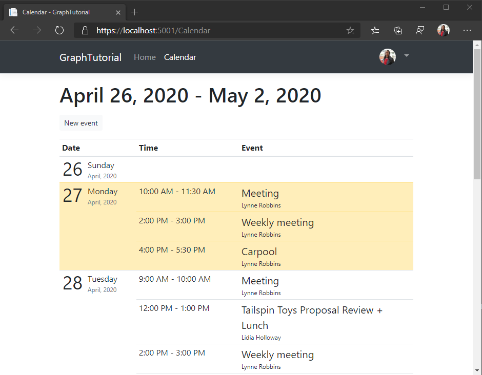

<!-- markdownlint-disable MD002 MD041 -->

En esta sección, incorporará Microsoft Graph a la aplicación. Para esta aplicación, usará la [biblioteca de cliente de Microsoft Graph para .net](https://github.com/microsoftgraph/msgraph-sdk-dotnet) para realizar llamadas a Microsoft Graph.

## <a name="get-calendar-events-from-outlook"></a>Obtener eventos de calendario de Outlook

Empiece por crear un nuevo controlador para las vistas de calendario.

1. Agregue un nuevo archivo denominado **CalendarController.CS** en el directorio **./Controllers** y agregue el siguiente código.

    ```csharp
    using GraphTutorial.Models;
    using Microsoft.AspNetCore.Mvc;
    using Microsoft.Extensions.Logging;
    using Microsoft.Identity.Web;
    using Microsoft.Graph;
    using System;
    using System.Collections.Generic;
    using System.Threading.Tasks;
    using TimeZoneConverter;

    namespace GraphTutorial.Controllers
    {
        public class CalendarController : Controller
        {
            private readonly GraphServiceClient _graphClient;
            private readonly ILogger<HomeController> _logger;

            public CalendarController(
                GraphServiceClient graphClient,
                ILogger<HomeController> logger)
            {
                _graphClient = graphClient;
                _logger = logger;
            }
        }
    }
    ```

1. Agregue las siguientes funciones a la `CalendarController` clase para obtener la vista de calendario del usuario.

    :::code language="csharp" source="../demo/GraphTutorial/Controllers/CalendarController.cs" id="GetCalendarViewSnippet":::

    Tenga en cuenta lo que `GetUserWeekCalendar` hace el código.

    - Usa la zona horaria del usuario para obtener los valores de fecha y hora de inicio y finalización de UTC para la semana.
    - Consulta la [vista de calendario](/graph/api/calendar-list-calendarview?view=graph-rest-1.0) del usuario para obtener todos los eventos comprendidos entre la fecha y hora de inicio y finalización. El uso de una vista de calendario en lugar de una [lista de eventos](/graph/api/user-list-events?view=graph-rest-1.0) expande los eventos periódicos y devuelve todas las repeticiones que se produzcan en la ventana de tiempo especificada.
    - Usa el `Prefer: outlook.timezone` encabezado para obtener resultados de vuelta en la zona horaria del usuario.
    - Usa `Select` para limitar los campos que se devuelven solo a los que usa la aplicación.
    - Usa `OrderBy` para ordenar los resultados cronológicamente.
    - Utiliza una `PageIterator` Página para a [través de la colección Events](/graph/sdks/paging). Esto controla el caso en el que el usuario tiene más eventos en su calendario que el tamaño de página solicitado.

1. Agregue la siguiente función a la `CalendarController` clase para implementar una vista temporal de los datos devueltos.

    ```csharp
    // Minimum permission scope needed for this view
    [AuthorizeForScopes(Scopes = new[] { "Calendars.Read" })]
    public async Task<IActionResult> Index()
    {
        try
        {
            var userTimeZone = TZConvert.GetTimeZoneInfo(
                User.GetUserGraphTimeZone());
            var startOfWeek = CalendarController.GetUtcStartOfWeekInTimeZone(
                DateTime.Today, userTimeZone);

            var events = await GetUserWeekCalendar(startOfWeek);

            // Return a JSON dump of events
            return new ContentResult {
                Content = _graphClient.HttpProvider.Serializer.SerializeObject(events),
                ContentType = "application/json"
            };
        }
        catch (ServiceException ex)
        {
            if (ex.InnerException is MicrosoftIdentityWebChallengeUserException)
            {
                throw ex;
            }

            return new ContentResult {
                Content = $"Error getting calendar view: {ex.Message}",
                ContentType = "text/plain"
            };
        }
    }
    ```

1. Inicie la aplicación, inicie sesión y haga clic en el vínculo de **calendario** en la barra de navegación. Si todo funciona, debería ver un volcado JSON de eventos en el calendario del usuario.

## <a name="display-the-results"></a>Mostrar los resultados

Ahora puede Agregar una vista para mostrar los resultados de forma más fácil de uso.

### <a name="create-view-models"></a>Crear modelos de vista

1. Cree un nuevo archivo denominado **CalendarViewEvent.CS** en el directorio **./Models** y agregue el siguiente código.

    :::code language="csharp" source="../demo/GraphTutorial/Models/CalendarViewEvent.cs" id="CalendarViewEventSnippet":::

1. Cree un nuevo archivo denominado **DailyViewModel.CS** en el directorio **./Models** y agregue el siguiente código.

    :::code language="csharp" source="../demo/GraphTutorial/Models/DailyViewModel.cs" id="DailyViewModelSnippet":::

1. Cree un nuevo archivo denominado **CalendarViewModel.CS** en el directorio **./Models** y agregue el siguiente código.

    :::code language="csharp" source="../demo/GraphTutorial/Models/CalendarViewModel.cs" id="CalendarViewModelSnippet":::

### <a name="create-views"></a>Crear vistas

1. Cree un nuevo directorio denominado **Calendar** en el directorio **./views** .

1. Cree un nuevo archivo con el nombre **_DailyEventsPartial. cshtml** en el directorio **./views/Calendar** y agregue el siguiente código.

    :::code language="cshtml" source="../demo/GraphTutorial/Views/Calendar/_DailyEventsPartial.cshtml" id="DailyEventsPartialSnippet":::

1. Cree un nuevo archivo denominado **index. cshtml** en el directorio **./views/Calendar** y agregue el siguiente código.

    :::code language="cshtml" source="../demo/GraphTutorial/Views/Calendar/Index.cshtml" id="CalendarIndexSnippet":::

### <a name="update-calendar-controller"></a>Actualizar el controlador de calendario

1. Abra **./Controllers/CalendarController.CS** y reemplace la `Index` función existente por lo siguiente.

    :::code language="csharp" source="../demo/GraphTutorial/Controllers/CalendarController.cs" id="IndexSnippet":::

1. Inicie la aplicación, inicie sesión y haga clic en el vínculo **calendario** . La aplicación ahora debería representar una tabla de eventos.

    
